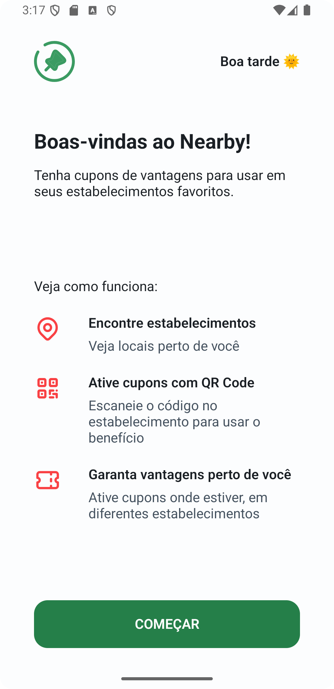
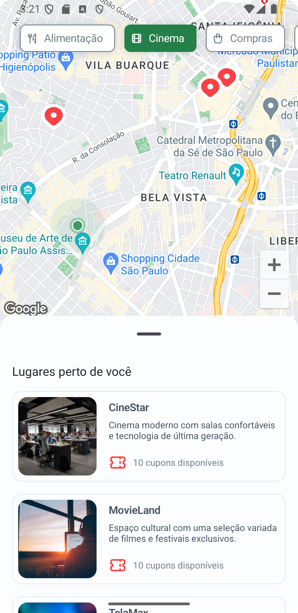
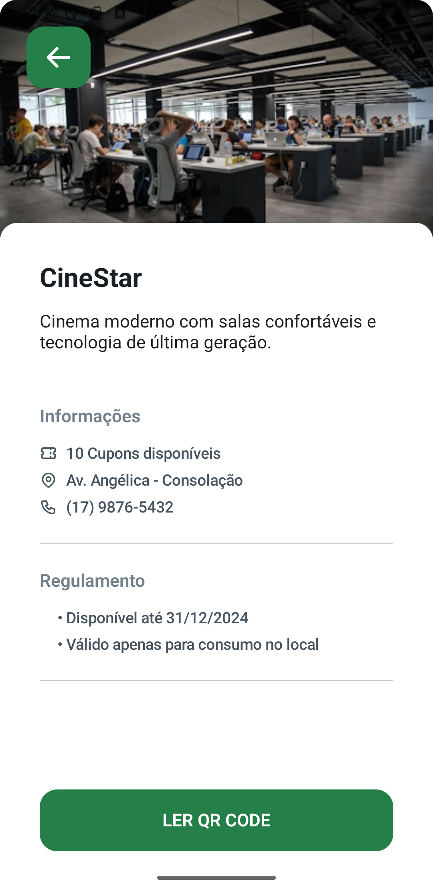
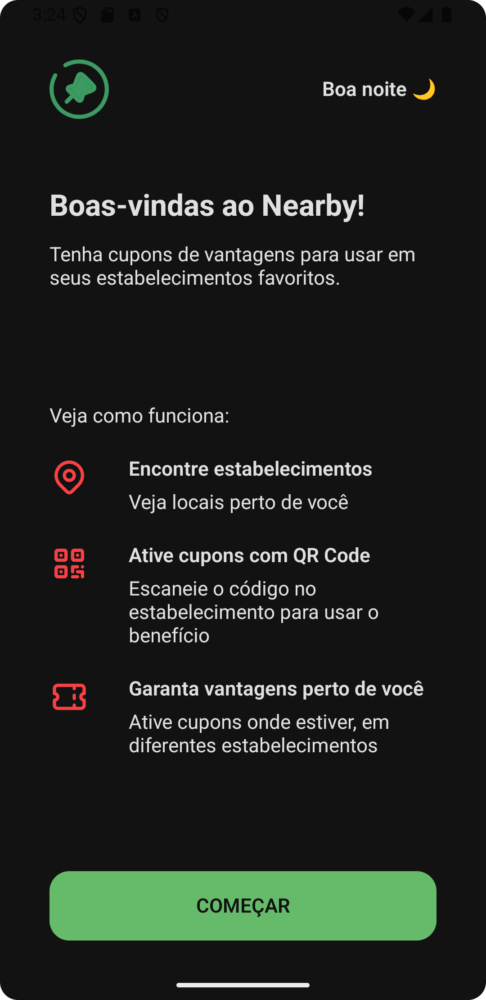
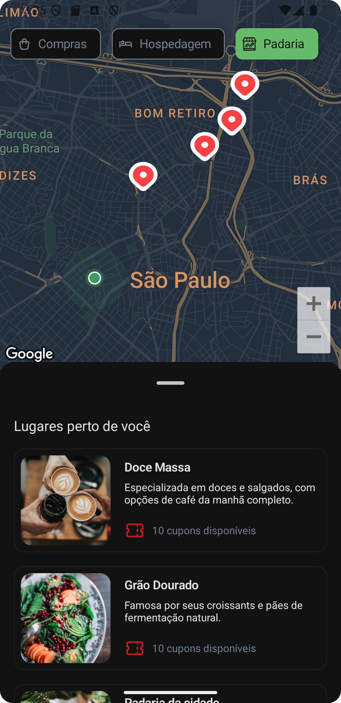
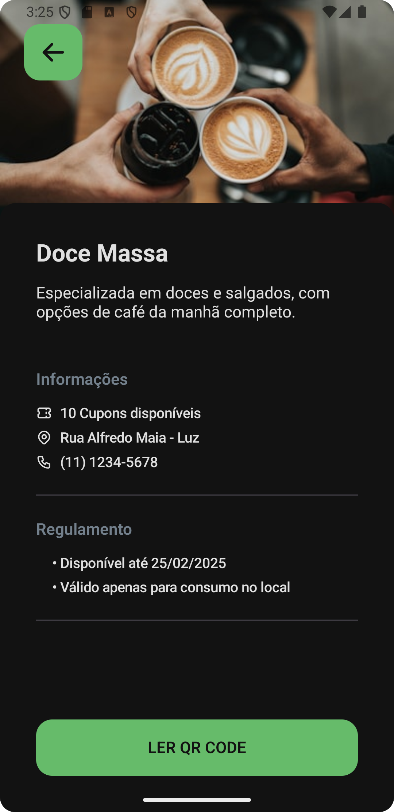
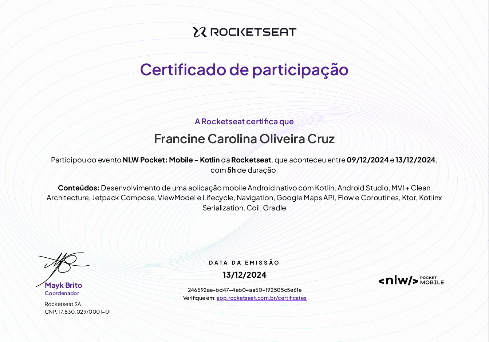

<h1 align="center">
  
  <br>Nearby - O Clube de Benefícios ao Seu Alcance!
      <p>
        
        
        
    </p>
</h1>

Participei do evento **NLW Pocket: Mobile - Kotlin**, promovido pela **Rocketseat**, para aprender sobre o desenvolvimento de aplicativos Android nativos. Durante três aulas práticas, construímos o **Nearby**, um app de clube de benefícios que permite localizar parceiros próximos, ativar cupons e aproveitar vantagens exclusivas.

## 🖼️ Visualização do Projeto
### ☀️ Versão Light

<div align="center">
    
</div>

### 🌑 Versão Dark

<div align="center">
      
</div>

## 🎥 Demonstração em Vídeo

Para visualizar o funcionamento do Nearby, no modo dark: [Faça o download aqui](./prints/Nearby.mp4)

## 🚀 Principais Tecnologias Utilizadas

-  Biblioteca para leitura e escaneamento de QRCode.
-  Framework utilizado para comunicação com o backend.
-  Linguagem principal para o desenvolvimento Android.
-  Integração de mapas utilizando Google Maps SDK.
-  Ferramenta essencial para criação de aplicativos nativos.
-  Biblioteca para construção de interfaces de usuário modernas.

## 🔄 Funcionalidades

### Desenvolvidas durante o evento:

- **🗺️ Localização de Parceiros**: O app permite visualizar parceiros próximos no mapa e ativar cupons de benefícios.

- **🔍 Leitura de QRCode**: Escaneamento de QRCodes para ativação de cupons exclusivos.

- **📍 Integração com Mapas**: Exibe a localização do usuário mockada e dos parceiros utilizando o Google Maps.

### Funcionalidades Extras que Desenvolvi:
- **🌗 Tema Claro/Escuro**: O aplicativo ativa automaticamente o modo escuro dependendo do horário.
- **👋 Saudação Personalizada**: Exibe mensagens como "Bom dia", "Boa tarde" ou "Boa noite" com base no horário do dispositivo.

## 🔙 Backend

O backend do projeto foi disponibilizado pela **Rocketseat** através do material fornecido durante o evento. Ele serviu como base para a comunicação do app e exibição dos dados

## 📦 Instalação e Execução
Para executar o projeto na sua máquina local, siga os passos abaixo:

1. Clone o repositório:

```

git clone https://github.com/Francine02/Nearby.git

```

2. Abra o projeto no Android Studio.

3. Configure o ambiente:

+ Certifique-se de ter o Android SDK instalado.
+ Use um emulador ou dispositivo físico com Android 8.0+ (API 24+).

4. Build e execução:

- Clique em Run no Android Studio.

### Observações:
- O backend do projeto não está incluído aqui, portanto, ao clonar e rodar o aplicativo, não irá aparecer os estabelecimentos conforme vídeo demonstração.
- É necessário, antes de rodar o projeto, criar e adicionar a sua chave da API do Google Maps

## 🤝 Contribuindo
Contribuições são sempre bem-vindas! Se você deseja melhorar algo, siga os passos:
1. Faça um fork deste repositório.
2. Crie uma branch para a sua feature (git checkout -b feature-nome-da-feature).
3. Faça o commit das suas alterações (git commit -m 'Adiciona nova feature').
4. Envie para o repositório remoto (git push origin feature-nome-da-feature).
5. Crie um novo Pull Request.

## 💜 Agradecimentos
Agradeço à [Rocketseat](https://github.com/Rocketseat) por promover o evento NLW Pocket: Mobile - Kotlin, que tornou possível a construção deste projeto e proporcionou um ambiente de aprendizado prático e inspirador.

<div align="center">
  
</div>
